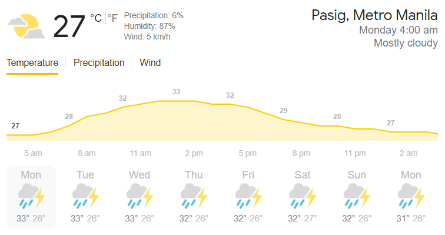

```{r setup, include=FALSE}
knitr::opts_chunk$set(echo = TRUE)
```

### **Question 1:**
#### Aside from reasons mentioned above, why do we need to study and analyze data?
**Data analysis** is *an important process to make the right decisions.* When one began to gather and analyze data, one will likely find it easier to reach a particular decision to make (Business Insights, 2019). With the use of data analysis, a complex and abstract problem is being simplified into series of small problems that can now be solved with the help of available data. The options are now being weighed based on different criteria that one has set to satisfy his own wants and needs. Because data is available everywhere and we acquire it every day, we started to look for patterns to make sense of the scattered data available. 

! [Alt text] (/Users/lesternielsalvador/Documents/GitHub/First-Markdown-Assignment/First Markdown Assignmentver0.01)

Data science is *being used as a tool to communicate with a certain group of people*, thus, it *helps in improving people’s lives.* This should be the main goal of a certain organization in obtaining and collecting data to design different tools that will help in improving people’s lives. Also, the use of data science allows organizations and individuals to more effectively determine the cause of the problem. With the help of data analysis, one will be able to visualize and determine striking relationships between circumstances that they encountered. When the problems have been pointed out, they will be able to strategize approaches in solving a particular problem that will increase their efficiency. Data analysis helps an individual and an organization to determine which should take priority over the others (The Council on Quality and Leadership, n.d.). 

! [Alt text] (/Users/lesternielsalvador/Documents/GitHub/First-Markdown-Assignment/First Markdown Assignmentver0.01)

Data interpretation and analysis is a significant aspect when we work with data sets in any field we are in. As we analyze data, it becomes helpful for us to acquire useful and relevant information from a lot of unorganized data that will enable us to arrive at a solid decision that is not only useful for businesses and researchers, but also for individuals. 


**References:**

12 reasons why data is important. (n.d.). The Council on Quality and Leadership. Retrieved July 9,
2021, from <https://www.c-q-l.org/resources/guides/12-reasons-why-data-is-important/>

The advantages of data-driven decision-making. (2019, August 26). Business Insights - Blog.
<https://online.hbs.edu/blog/post/data-driven-decision-making>


---

### **Question 2:**
#### Cite atleast one instance or application where data science was used and contributed on policy-making, day-to-day decisions, knowing market trends, and scientific researches.
One of the applications of data science in everyday life is **data personalization by a person’s preferences** in entertainment websites or apps such as *Spotify* and *Netflix*. Netflix programming uses algorithms that are designed to produce shows, and then catered to their consumers whose behavior patterns suggest that they might like their programming that came from their databases. This allows them to customize the watchlist of their consumers in accordance with popular actors, genre, or just through consumer preference (Jahnke, 2019). Meanwhile, similar to Netflix, Spotify also uses data in order to customize their weekly playlist of songs that again, cater to the preferences of their consumers. Through modern data science technologies, not only do the users of these entertainment apps or websites get entertained, but also allows the distributors to save lots of money that once would have been spent on marketing. It also allows these distributors not only to acquire the licensing of certain content from other distributors to satisfy their consumers but also to “create” content themselves (such as the Netflix original series Stranger Things) because they know what their consumers would like. 


Another application of data science is in the **healthcare industry**. It plays a very important role in monitoring a patient’s health and notifying necessary steps to be taken in order to detect potential diseases in order to prevent them from taking place. This proved to be very beneficial as a late detection of any disease would not only be detrimental to a person’s health but it would also cost them a lot of money to treat the disease or ailment (Data Flair, 2021). Data science also helps in monitoring a patient’s health. Wearable devices that track heartbeat, temperature and other medical parameters collect data that would be soon analyzed by doctors or/and medical experts to not only detect any sign of ailment or disease but also to keep track of a patient’s blood pressure, calorie intake and many others. These devices use real-time analytics to predict any problem based on the patient’s present condition, which helps doctors assess the necessary conditions to help patients in distress.


Finally, another notable application of data science is in the **Finance sector**. Banks can now easily manage massive amounts of data to learn more about their clients so that they could drive new revenue opportunities and improve their business decision making. Another is an effective customer support service. Clients could just easily contact a customer service representative through landline or through the internet (via email and voice chat or call), which enables them to ask questions or send complaints without the need (or at least limits the necessity) to personally go to a bank. It also enables clients to “pay online” or “contactless payment” which enables their clients to shop online through the use of a credit or debit card. Finally, through data science, banks can safely handle and keep track of their clients accounts to avoid credit card fraud, the breach of important financial data, and any other suspicious activity that would compromise their clients’ financial accounts (Activewizards, n.d). 


**References:**

Data Flair (2021, April 02). Data Science in Healthcare - 7 Applications No one will Tell You. Retrieved July 08, 2021, from https://data-flair.training/blogs/data-science-in-healthcare/

Jahnke, A. (2019, March 07). Netflix, Spotify, and how data is shaping the arts. Retrieved July 08, 2021, from https://www.bu.edu/articles/2019/data-arts/

Activewizards (n.d.) Top 9 data science use cases in banking. Retrieved July 09, 2021, from https://activewizards.com/blog/top-9-data-science-use-cases-in-banking/ 


---

### **Question 3:**
#### Propose atleast one data science topic that you want to pursue: Have a broad description of the topic, describe the availability of the data, what kinds of statistical method you think you will need, and who would benefit this study.


#### Salvador, Lester Niel S.

The pandemic has brought us lots of challenges that made us look for ways on how to survive the economic regression. A lot of Filipinos have started their own small businesses such as online thrift shops, foods, and many more. Because of this, I became interested in the growth of Micro, Small, and Medium Enterprises (MSMEs) in the Philippines. Big businesses are the ones who may control the stock market, but it is the small businesses and start ups that keep the economy moving. Small businesses are commonly found in the local barangays and places, thus, generating more jobs and opportunities for local individuals. Small businesses also have great potential because it is more often started by individuals who have great ideas and aims to bring innovation and something new in the industry.

This topic is timely and relevant to what the country is experiencing and it becomes more interesting on how people are dealing with the lack of jobs and worsening economy by establishing their own small businesses. We can gather data from the website of the Department of Trade and Industry for the number of small businesses established for 2018-2019, the United Nations Philippines official website, and other studies about the growth of MSMEs in the Philippines more especially in the time of the pandemic. 
 
The statistical methods that we will be using for this study would be numerical analysis of pre-existing data from reliable sources, data management, and making generalizations and conclusions based on the data that we have gathered. The main group of people who will benefit from this study is those who have plans in starting their own businesses in the middle of the pandemic and existing MSME owners so they can devise their own plans for the betterment of their business. 

![Alt text] (/Users/lesternielsalvador/Documents/GitHub/First-Markdown-Assignment/First Markdown Assignmentver0.01)


#### Sison, Justine Matthew 

One possible data science topic we could pursue is to determine the unemployment rate of people in Metro Manila during the pandemic. Many businesses had closed down and many companies laid off some if not most of their workers to minimize their spending due to the lockdown where their consumers had drastically reduced, thus having little to no revenue. Because of that, there should be an increase in the unemployment rate, but we would like to determine at what percentage the unemployment rate increased when compared to 2019, the year before 2020 where the pandemic began. Since the country is vast, we decided to focus on the unemployment rate here in Metro Manila, one of the most, if not the most, urban cities in the country where most of the country’s local labor force are situated. However, the population in Metro Manila is very populous, where according to world population review, the estimated population in Metro Manila is about 14 million (World Population Review, 2021). Not to mention that we have very limited means to conduct a survey with a very large sample size due to the limitations imposed by the government and other limitations during the pandemic.


Therefore, we would like to conduct a survey with a Stratified Random Sampling as a means to determine the unemployment rate in Metro Manila. We would like to get 25 respondents from each of the 17 municipalities in Metro Manila, which would give us a total of 425 respondents. Although it would be better if we have a larger sample size, we felt that we cannot conduct a survey with more than 25 respondents due to the limitations brought by the pandemic. And then, we would determine if there was a significant increase in the unemployment rate by comparing the 2 rates. The government could learn from this survey in order to loosen up their lockdown policies or/and help those who were unemployed in the pandemic by enacting certain policies. 


**Reference:**

World Population Review (2021). Manila Population 2021. Retrieved July 10, 2021 from: https://worldpopulationreview.com/world-cities/manila-population 


#### Castillo, Jose Xavier C.

### **Question 1:**
Data science is a valuable field of study  because the vast amounts of raw data acquirable online and in person is just “white noise” that makes little sense to anyone who isn’t a statistician. It is up to the people who study data science to make sense of this data and present it in ways that allow the general public to understand and make use of this data. 

### **Question 2:**


One instance of data science contributing to change is the many different statistics that are used in gauging the effects of global warming. Massive amounts of data gathered by scientists around the world about the ever changing environment are used as a basis on sanctioning harmful industries and practices, all for the sake of the environment.

### **Question 3:**


One data science topic I would personally like to pursue is the science of “Card Counting”. According to Wendover productions, this practice is entirely legal and only looked down upon by casino management. It basically uses probability and statistics on the fly to consistently know what your odds are in any casino game, from blackjack to poker. The availability of data is of no concern as many blackjack and poker games are available online and in real life, while the calculations performed by many famous card counters are also readily available. The only one who would benefit from this study is myself of course.


**Reference:**

https://insidebigdata.com/2020/04/14/data-science-is-changing-the-world-for-the-better-heres-how/

https://www.youtube.com/watch?v=Ongqf93rAcM


#### Zablan, Sun Phil M.

One data science topic that interests me is on knowing how accurate the weather forecasts are compared to the actual weather. The weather can get pretty extreme and sometimes the forecasts don't pick up these sudden changes, it'd be useful to know just how much we can expect from the forecasts to be accurate so as to not have bad weather delaying your plans. The way we can work on it is to compile the temperature predictions from reliable source/s for one week and take the real temperatures for comparison, how much it deviates from the predictions. The statistical method we can use here is a descriptive one, by formulating a graph using already existing information, getting the standard deviations is a key part in this project.




**Reference**

https://weather.com/weather/today/l/14.58,121.09?par=google


---

---
